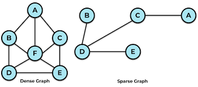

📅 Week 02 (Apr 7 - Apr 12, 2025)

# 2주차 BFS(Breadth-First Search)

  

## 1️⃣ BFS(너비 우선 탐색) 알고리즘 작동 원리를 설명하고, 어떤 자료구조를 사용하는지, 그리고 그 이유는 무엇인지 설명해주세요.

### 너비 우선 탐색의 정의:
- 시작 노드와 거리가 가장 가까운 노드를 우선하여 방문하는 방식의 탐색 알고리즘
- 먼저 발견한 노드를 먼저 방문해야 하기 때문에, FIFO(First-In, First-Out) 구조인 큐(Queue)를 사용
- 거리: 시작 노드에서 목표 노드까지의 간선 수 (가중치의 합이 아님)

### 작동 원리
- 시작 노드를 큐에 삽입하고 방문 처리
- 큐가 비어있지 않은 동안 다음을 반복:
    - 큐에서 노드를 꺼냄
    - 꺼낸 노드와 인접한 노드 중, 아직 방문하지 않은 노드를 큐에 추가하고 방문 처리
- 이 과정을 통해 현재 방문한 노드와 직접 연결된 모든 노드를 먼저 방문하게 됨

  

## 2️⃣ BFS와 DFS(깊이 우선 탐색)의 차이점은 무엇이며, 각각 어떤 종류의 문제에 더 적합한지 예시를 들어 설명해주세요.
- 깊이 우선 탐색은 깊게 탐색 후 되돌아오는 특성이 있고, 너비 우선 탐색은 가중치가 없는 그래프에서 최단 경로를 보장

### DFS (깊이 우선 탐색)
- 한 방향으로 깊게 탐색한 후, 더 이상 탐색할 수 없으면 되돌아오는 방식 (백트래킹)
- 모든 가능한 경우의 수를 탐색하는 문제나, 사이클 탐지에 유리
- 예시: 퍼즐 문제, 미로에서 모든 경로 탐색, 그래프 사이클 확인 등

### BFS (너비 우선 탐색)
- 시작 노드로부터 가까운 노드부터 탐색
- 가중치가 없는 그래프에서 최단 경로를 보장
- 예시: 최단 거리 탐색(미로 찾기), 소셜 네트워크에서 친구 추천 거리 계산 등

  

## 3️⃣ BFS 알고리즘의 시간 복잡도는 O(V + E)인데, 그래프의 형태(예: 밀집 그래프 vs 희소 그래프)가 실제 수행 시간에 어떤 영향을 미칠 수 있을지 설명해주세요.
- 시간 복잡도: O(V + E)
    - V는 노드(정점)의 수, E는 간선(변)의 수
- 밀집 그래프(dense graph)와 희소 그래프(sparse graph)의 구분은 절대적인 기준이 아니라 "그래프의 노드 수에 비해 간선이 많은가 적은가?"를 기준으로 상대적으로 구분
- 희소 그래프 (Sparse Graph): 간선 수 E가 V에 비해 상대적으로 적은 경우 -> 실제 수행 시간이 빠름
- 밀집 그래프 (Dense Graph): 간선 수 E가 V²에 가까운 경우 -> 간선 탐색이 많아져 수행 시간이 상대적으로 더 오래 걸림
- 👉 즉, 이론상 시간 복잡도는 같아도, 그래프의 밀도에 따라 실제 실행 시간은 큰 차이가 날 수 있음

    
